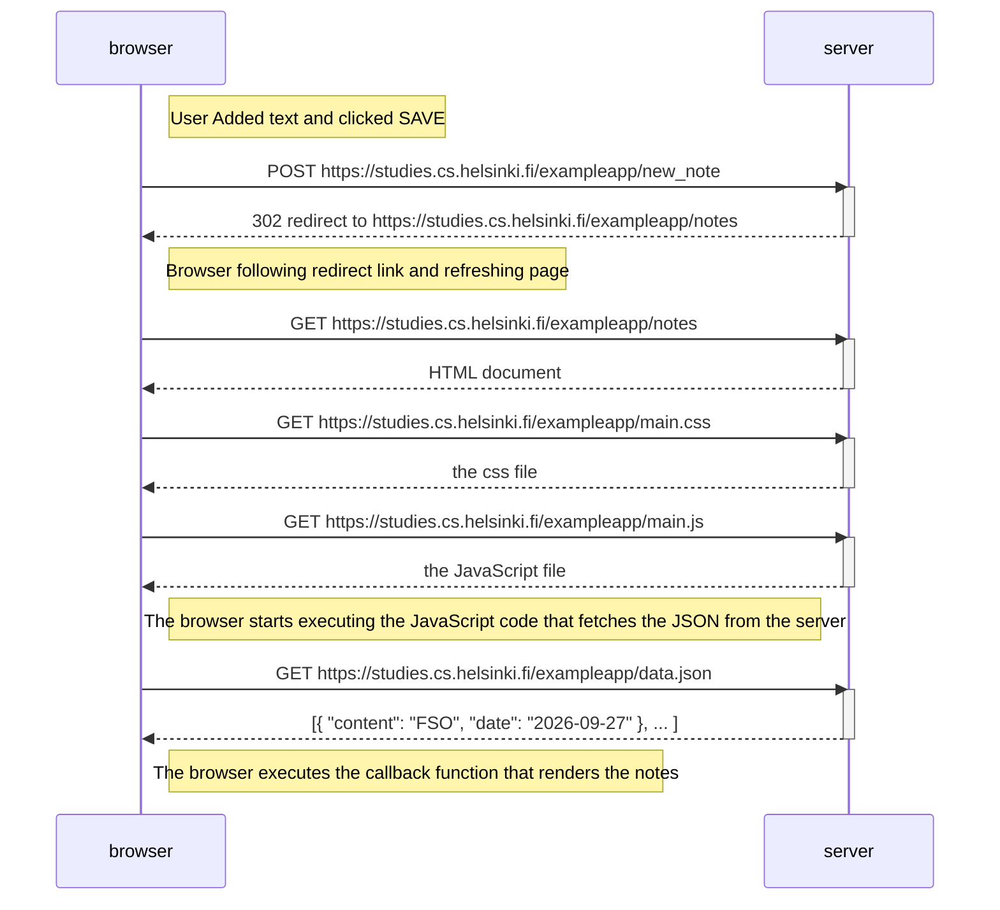
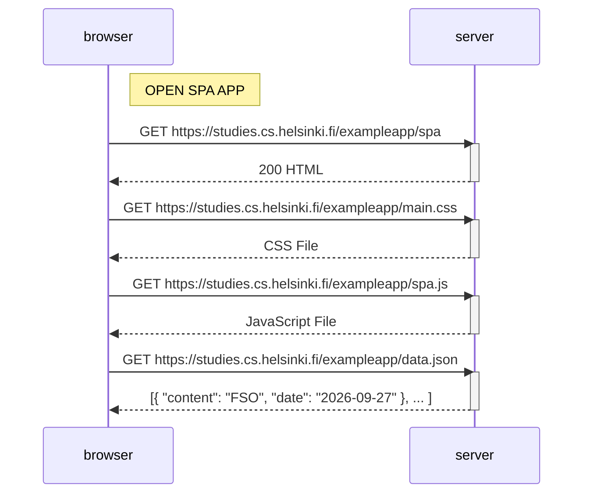
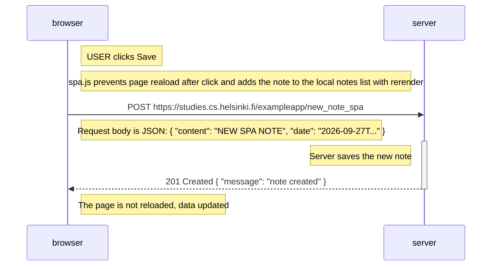

# Part 0

## 0.1: HTML - DONE
## 0.2: CSS - DONE
## 0.3: HTML FORMS - DONE

## 0.4: New note diagram

```mermaid
    sequenceDiagram
        participant browser
        participant server
    
        Note right of browser: User Added text and clicked SAVE 
    
        browser->>server: POST https://studies.cs.helsinki.fi/exampleapp/new_note
        activate server
        server-->>browser: 302 redirect to https://studies.cs.helsinki.fi/exampleapp/notes
        deactivate server
    
        Note right of browser: Browser following redirect link and refreshing page
    
        browser->>server: GET https://studies.cs.helsinki.fi/exampleapp/notes
        activate server
        server-->>browser: HTML document
        deactivate server
    
        browser->>server: GET https://studies.cs.helsinki.fi/exampleapp/main.css
        activate server
        server-->>browser: the css file
        deactivate server
    
        browser->>server: GET https://studies.cs.helsinki.fi/exampleapp/main.js
        activate server
        server-->>browser: the JavaScript file
        deactivate server
    
        Note right of browser: The browser starts executing the JavaScript code that fetches the JSON from the server
    
        browser->>server: GET https://studies.cs.helsinki.fi/exampleapp/data.json
        activate server
        server-->>browser: [{ "content": "FSO", "date": "2026-09-27" }, ... ]
        deactivate server
    
        Note right of browser: The browser executes the callback function that renders the notes 
```

## 0.5: Single page app diagram

```mermaid
    sequenceDiagram
        participant browser
        participant server
    
        Note right of browser: OPEN SPA APP
    
        browser->>server: GET https://studies.cs.helsinki.fi/exampleapp/spa
        activate server
        server-->>browser: 200 HTML
        deactivate server
    
        browser->>server: GET https://studies.cs.helsinki.fi/exampleapp/main.css
        activate server
        server-->>browser: CSS File
        deactivate server
    
        browser->>server: GET https://studies.cs.helsinki.fi/exampleapp/spa.js
        activate server
        server-->>browser: JavaScript File
        deactivate server
    
        browser->>server: GET https://studies.cs.helsinki.fi/exampleapp/data.json
        activate server
        server-->>browser: [{ "content": "FSO", "date": "2026-09-27" }, ... ]
        deactivate server
```

## 0.6: New note in Single page app diagram

```mermaid

    sequenceDiagram
        participant browser
        participant server
    
        Note right of browser: USER clicks Save
    
        Note right of browser: spa.js prevents page reaload after click and adds the note to the local notes list with rerender
    
        browser->>server: POST https://studies.cs.helsinki.fi/exampleapp/new_note_spa
        Note right of browser: Request body is JSON: { "content": "NEW SPA NOTE", "date": "2026-09-27T..." }
        activate server
        Note left of server: Server saves the new note
        server-->>browser: 201 Created { "message": "note created" }
        deactivate server
    
        Note right of browser: The page is not reloaded, data updated

```